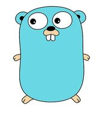

# GO

- Clean concise syntax
- Simple and regular grammar(only 26 keywords)
- Reduced typing
- Lightweight type system (no type hierarchy) with flexibility of dynamic language.
- No Implicit conversions.
- Untyped unsized constants
- Strict separation of interface and implementation
- Garbage collection
- Good support for strings
- Good support for concurrency (goroutines and channels)
- Explicit dependencies to enable faster builds (package)
- Natively compiled
