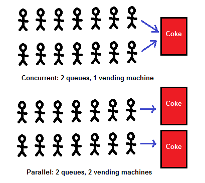
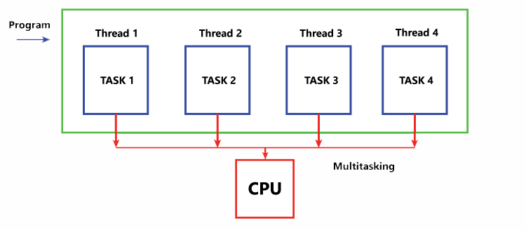
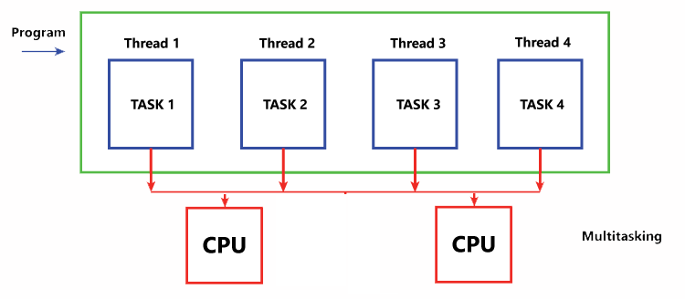
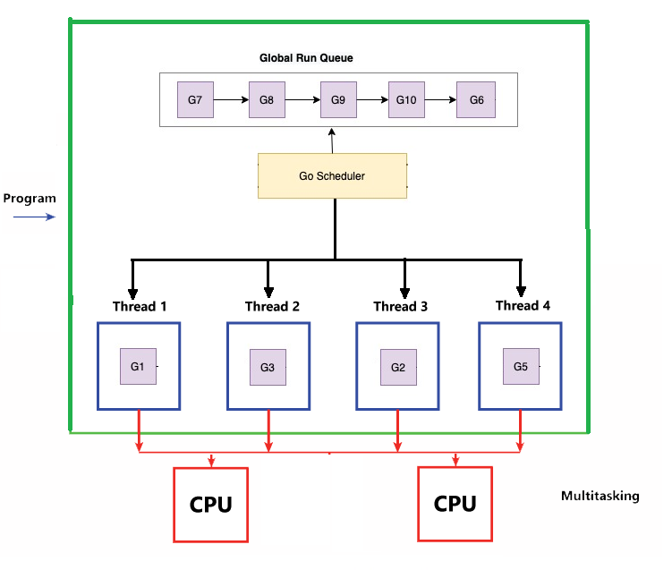

# Concurrency

Concurrency is an ability of a program to do multiple things at the same time. This means a program that have two or more tasks that run individually of each other, at about the same time, but remain part of the same program.

## Concurrency vs parallelism

## Concurrency is not parallelism by Rob Pike
https://www.youtube.com/watch?v=oV9rvDllKEg&t=332s 

# Single Core

# Multi core 

# Goroutines

