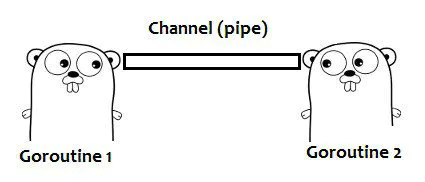

# Channels



A channel is a communication object using which goroutines can communicate with each other. Technically, a channel is a data transfer pipe where data can be passed into or read from. Hence one goroutine can send data into a channel, while other goroutines can read that data from the same channel

## Declaring a channel

```
var resultChannel chan int
resultChannel = make(chan int)

```

A channel can transport data of only one data type. No other data types are allowed to be transported from that channel.

## Data read and write

```
resultChannel <- data
```

```
result := <- resultChannel
```
All the above channel operations are blocking by default.
