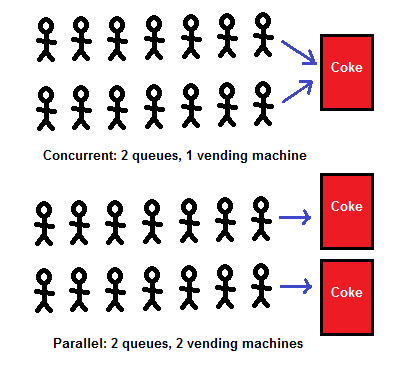
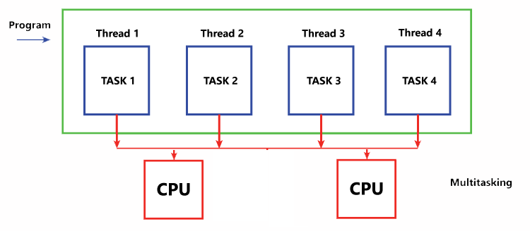
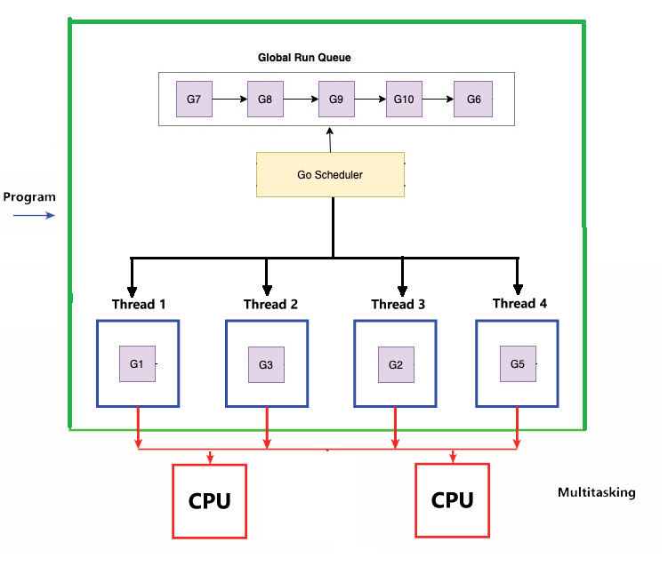

## Concurrency vs parallelism

## Concurrency is not parallelism by Rob Pike
https://www.youtube.com/watch?v=oV9rvDllKEg&t=332s 

# Program, Process, Threads, Processor, Core, Goroutines

A program is a set of instructions or a sequence of code written to perform a specific task or a set of tasks when executed.

A process, on the other hand, is a dynamic execution of a program. It is an instance of a running program that is being executed by the computer's operating system.

A thread is a smaller unit of a process that can execute independently. 
Threads are sequences of instructions within a process that can be scheduled and executed independently by the operating system. 

The term "processor" refers to the entire physical central processing unit (CPU) or the microprocessor chip that serves as the brain of a computer

A core is a processing unit within the CPU that can execute its own set of instructions independently.
Modern CPUs often have multiple cores, allowing them to perform multiple tasks simultaneously. Each core has its own arithmetic logic unit (ALU) and control unit.

The fundamental concept of a core in a processor is that it can execute one thread at a time.

In a single-core processor, only one thread can be processed at any given time. However, in a multi-core processor, multiple cores can work in parallel, allowing for concurrent execution of multiple threads. 

The decision of which thread to run on which core is typically made by the operating system's scheduler. The scheduler is a part of the operating system kernel, and its primary responsibility is to manage the execution of processes and threads on the CPU

Goroutines are a feature of the Go programming language designed for concurrent programming.
They are managed by the Go runtime, not the operating system. The Go runtime scheduler handles the creation, scheduling, and termination of goroutines.

goroutines are multiplexed onto a smaller number of operating system (OS) threads by the Go runtime scheduler. The Go runtime provides an abstraction over OS threads, allowing for the efficient execution of many goroutines on a smaller number of OS threads. This approach provides lightweight concurrency with lower overhead compared to traditional threading models.

# Single Core

# Multi core 

# Goroutines

https://www.youtube.com/watch?v=5LfqrEGwDmE&t=28s