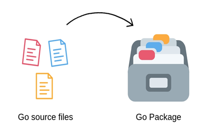

# Go Package

A package is nothing but a directory inside your Go workspace containing one or more Go source files.
Package helps to organize related code together and avoids naming conflicts



## Steps

1. Create folder go-training/package
2. go mod init go-training/package
3. Create main.go
4. mkdir /go-training/package/company
5. cd company
6. make company.go

To declare a source file to be part of a package, we use the following syntax as the first line of every file in the package
package <packagename>.(packagename will be the foldername)

```
package company

import (
	"fmt"
)
var companyName string = "google"

func PrintCompany() {
	fmt.Println(companyName)
}
```

7. in /go-training/package/main.go

```
package main

import (
	"fmt"
	"go-training/package/company"
)

func main() {
	company.PrintCompany()
}
```
8. in /go-training/package/company/department.go

```
package company

import "fmt"

func PrintDepartment() {
	fmt.Printf("Engineering department at %s \n", companyName)
}
```

9. in /go-training/package/main.go
   
```
func main() {
	company.PrintCompany()
	company.PrintDepartment()
}
```

- PrintDepartment() function in department.go could access the global variable comapnyName in company.go
- PrintCompnay() and PrintDepartment() function even though are in different files belongs to same package company. 
- global variables declared in any files in a package are available  through out that package.
- If a global variable oR function inside a package starts with an uppercase letter , it gets exported outside the package (private, public)


