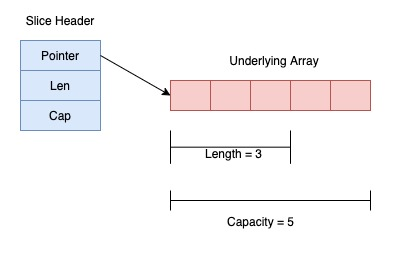
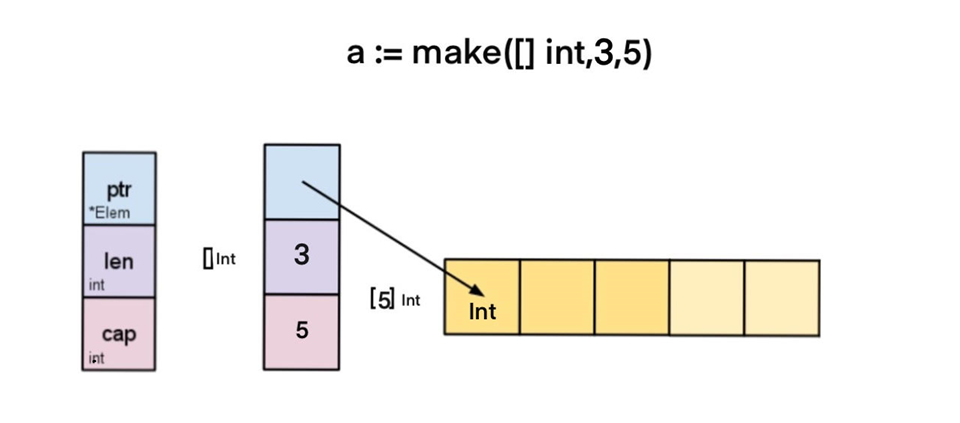
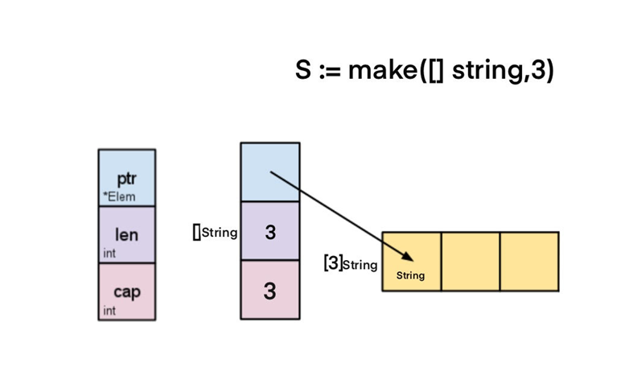
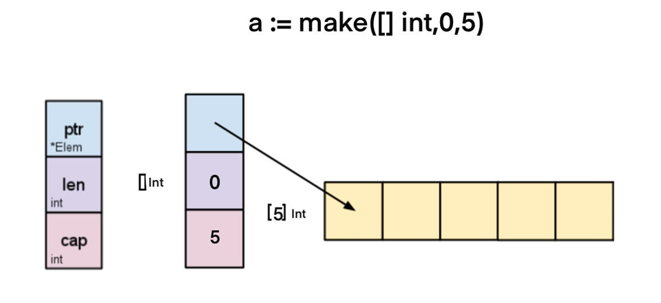

# Components of Slice

- Pointer: The pointer is used to points to the first element of the array that is accessible through the slice. Here, it is not necessary that the pointed element is the first element of the array.
- Length: The length is the total number of elements present in the array.
- Capacity: The capacity represents the maximum size upto which it can expand.

